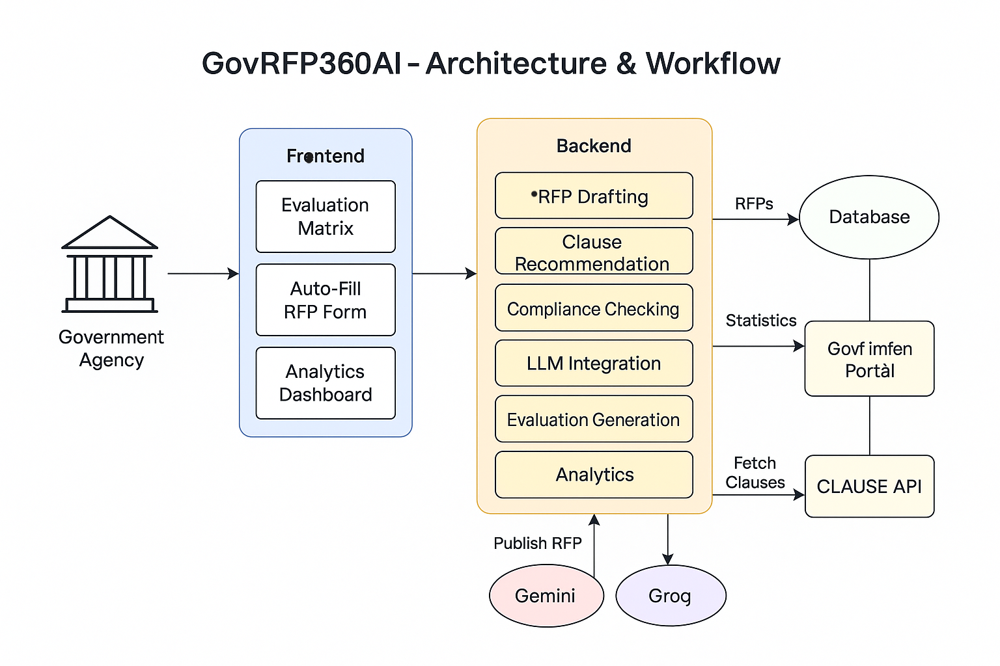

# 🏛️ GovRFP360AI

GovRFP360AI is a Generative AI-powered web platform designed to help government agencies streamline their RFP (Request for Proposal) workflows. It automates the creation of compliant, standardized proposal documents, enables automated regulatory compliance checks, and offers advanced semantic search over document collections.
---

# Demo
https://github.com/user-attachments/assets/7171adb4-45aa-4686-a88a-6f3aece77c2c

---

## 📊 Architecture & Workflow



## 🌟 Project Architecture Overview
GovRFP360AI consists of two interconnected modules designed to handle the complete procurement lifecycle:

### 📝 Part 1: RFP Generation Engine
Automated RFP document creation using Gemini LLM with intelligent templates and contextual suggestions.

### 🔍 Part 2: Compliance Verification System
RAG-powered compliance checking with similarity search against government regulations and procurement standards.


## Demonstration:

### [🎥 Watch Demo Video](public/video_demo.mp4)
---

## 🔧 Key Features

- 📝 Auto-Fill RFP using project metadata
- 🧠 AI Clause Recommendation
- ✅ Compliance Checking
- 📈 Evaluation Matrix Generation
- 📊 Analytics Dashboard
- 🌐 Multi-Language Support (Hindi & English)
- 🤖 LLM Integration (Gemini, Groq)

---

## Installation

Follow these steps to set up the project on your local machine:

```bash
# Clone the repository
git clone https://github.com/zuberkhan01st/GovRFP360AI.git
cd GovRFP360AI

# Navigate to backend
cd backend
npm install

# Navigate to frontend
cd ../frontend
npm install --legacy-peer-deps

# Set environment variables
cp .env.example .env
# Edit .env with your credentials

# Run the servers
npm start (in backend)
npm run dev (in frontend)

```


# ⚙️ Tech Stack

### 🔵 Frontend
- **Framework:** Next.js (13/14 App Router), TipTap, 
- **Language:** TypeScript
- **Styling:** Tailwind CSS, PostCSS
- **Component system:** React with modular folders (components, hooks, ui)
- **Package management:** npm, pnpm
- **Build tools:** Next.js Config, PostCSS, Tailwind config
- **Libraries:** jsPDF, Redux

### 🟢 Backend
- **Runtime:** Node.js
- **Framework:** Express.js, FastAPI
- **Language:** JavaScript
- **LLM Integration:** 
  - Google Gemini API
  - Groq LLM API
- **Vector Database:** Weaviate
- **Environment Config:** dotenv


